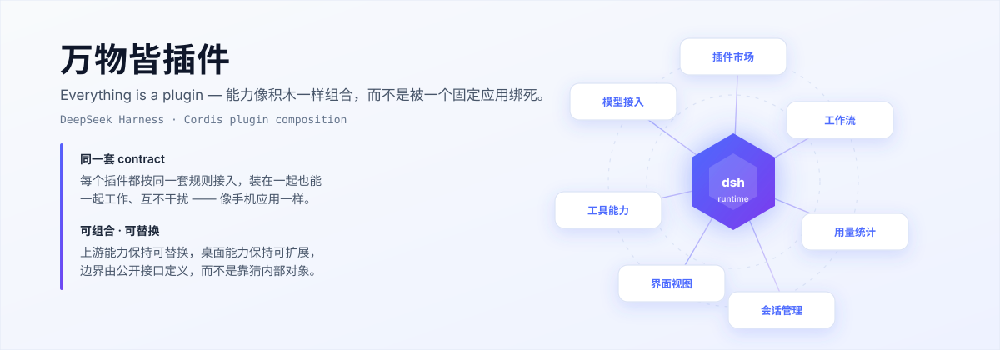

<h1 align="center">dsh-plugins</h1>

<p align="center">
  <strong>万物皆插件 —— 让 DeepSeek Harness 的能力像积木一样组合。</strong>
</p>

<p align="center">
  模型、工具、界面、工作流，都可以是一个插件；<br>
  插件之间遵循同一套 contract，装在一起也能一起工作、互不干扰。
</p>

<p align="center">
  
</p>

<p align="center">
  <a href="https://github.com/deepseek-ai/deepseek-harness"></a>
  <a href="LICENSE"></a>
  
  
</p>

<p align="center">
  <a href="#一30-秒开始">30 秒开始</a> ·
  <a href="#二安装教程">安装教程</a> ·
  <a href="#三文档地图">文档地图</a> ·
  <a href="#四插件清单">插件清单</a> ·
  <a href="#五贡献">贡献</a>
</p>

---

## 立意：为什么「万物皆插件」

DeepSeek Harness 的核心是一个**可组合的 agent harness**——它不把能力焊死在一个固定应用里，
而是让模型、工具、界面、工作流各自成为独立单元，按同一套 contract 组合进同一个运行时。
这正是 [Cordis](https://github.com/cordiverse/cordis) 的插件思想，也是本仓库存在的理由。

本仓库要做的是同一件事的**另一半**：让这些单元**装得上、装得对、装回来了还能用**。

| | 上游负责 | 本仓库负责 |
|---|---|---|
| 关注点 | 能力如何被组合 | 组合件如何被可靠分发 |
| 产出 | agent、模型、工具、会话、插件系统 | 离线 tarball、兼容矩阵、装前闸门、收录快照 |
| 失败模式 | —— | 上游更新后，用户装不回当初验证过的那一版 |

因此本仓库不只是「一堆插件包的集合」，而是**围绕兼容性设计的分发层**：
按 dsh 版本分层、装前跑兼容性闸门、失败自动回滚、**并把验证过的字节固定成不可变快照**。

> **运行时基线：dsh `0.1.6-alpha.1`** —— 这个版本不是随便选的，见
> [版本兼容矩阵](./docs/版本兼容矩阵.md)。
> 仓库内含离线 tarball 与[收录快照](./collection/README.md)，可在新机上完整复现。

**内容构成**：部分是自研插件，部分是收集整理的他人开源插件。
所有插件均为 **MIT** 许可；第三方插件的版权归原作者所有，来源、作者与上游仓库见
[插件清单](#四插件清单)与[收录介绍](./collection/README.md)。

---

## 一、30 秒开始

**唯一安装路径：GUI 里的「插件市场」面板。**

> ### ⚠️ 只有一种安装方式
>
> 自 2026-09 起，插件**一律通过「插件市场」面板安装**，不再逐个用命令行装。
> 市场在每次安装前会跑兼容性闸门（环境 / profile / 候选包三层），致命项硬拦截，
> 失败自动回滚 —— 这是批量安装脚本给不了的保护。

前置只有一个：**Node ≥ 22.19**。

```bash
git clone https://github.com/HaydenSmith1121/dsh-plugins
cd dsh-plugins
```

### 第 1 步：装引导插件（唯一需要命令行的安装）

| 平台 | 命令 |
|---|---|
| Windows | `scripts\install.cmd` |
| Windows（PowerShell 里） | `.\scripts\install.ps1` |
| macOS / Linux | `./scripts/install.sh` |

只装 `dsh-plugins-market` 这一个引导插件，并做四步校验。
不改动任何东西、只看体检结果：

```powershell
.\scripts\install.ps1 -PreflightOnly
```

### 第 2 步：在面板里点装其余插件

```bash
dsh web
```

左侧导航栏 →「插件市场」→「已验证」页签 → 挑插件点「安装」→ **再重启一次**。

装完想确认装对了，跑一次四步校验（含真实启动）：

```bash
node scripts/verify.mjs
```

遇到报错先别慌 —— 常见故障按层次对号入座：

| 症状 | 去看 |
|---|---|
| `dsh --version` 不是 `0.1.6-alpha.1` | [版本兼容矩阵 § 两条必须记住的规矩](./docs/版本兼容矩阵.md#二两条必须记住的规矩) |
| 装到一半报 `ERR_PNPM_IGNORED_BUILDS` | [注意事项 § 这个报错极具欺骗性](./docs/注意事项.md#-特别当心errpnpmignoredbuilds-的假象) |
| GUI 里看不到某个插件 | [安装教程 § 排查顺序](./README-安装说明.md#七gui-里看不到某个插件按这个顺序查) |
| 想退掉某个插件 | [安装教程 § 卸载 / 回滚](./README-安装说明.md#九卸载-回滚) |

---

## 二、安装教程

**全文：[`README-安装说明.md`](./README-安装说明.md)** —— 唯一的安装文档，自包含。
每一步都把「容易出错的地方」写成了预防措施和自检项，照着走就不会遇到那些问题。

| 章节 | 内容 | 什么时候看 |
|---|---|---|
| [一、30 秒开始](./README-安装说明.md#一30-秒开始) | clone → 装引导插件 → 面板点装 | 第一次装 |
| [二、环境要求](./README-安装说明.md#二环境要求) | Node / pnpm / dsh 的版本要求 | 装之前 |
| [三、dsh 版本为什么锁死](./README-安装说明.md#三dsh-版本为什么必须锁定-016-alpha1) | 版本不对会怎样、静默降级陷阱 | 升级 dsh 之前 ★ |
| [四、手动安装](./README-安装说明.md#四手动安装不想用脚本时) | 不想用脚本时逐条命令 | 脚本用不了 |
| [五、路径要求](./README-安装说明.md#五路径要求-装之前先看) | 仓库目录不能删、不能挪 | 装之前 ★ |
| [六、安装后校验](./README-安装说明.md#六安装后校验四步缺一不可) | 版本 / 依赖层 / 装配层 / 真实启动 | 装完 |
| [七、看不到插件怎么查](./README-安装说明.md#七gui-里看不到某个插件按这个顺序查) | 按层次定位，含 `ERR_PNPM_IGNORED_BUILDS` | 出问题时 |
| [八、凭据不随包迁移](./README-安装说明.md#八凭据与登录态不随包迁移) | API key / 登录态要重填 | 换机器 |
| [九、卸载 / 回滚](./README-安装说明.md#九卸载-回滚) | `dsh plugin remove` 与备份 | 想退掉插件 |
| [十、`dsh-opencode-go-plus` 的来历](./README-安装说明.md#十关于-dsh-opencode-go-plus-的来历改造与共存禁忌) | 派生来源、共存禁忌 | 用到这个插件 |
| [附录：tarball 校验信息](./README-安装说明.md#附录tarball-校验信息) | 每个 tarball 的内容自检 | 核对分发内容 |

> **要开发插件？先隔离环境。** 别直接在默认的 `~/.dsh` 上改 ——
> `dsh web` 不能起两次，第二个进程会抢端口，插件树改坏则整个 harness 起不来。
> 仓库自带隔离脚手架，完整说明见 [`README-开发环境隔离.md`](./README-开发环境隔离.md)：
>
> ```bash
> node scripts/dev-env.mjs init     # 在 ~/.dsh-dev 建一套独立的 harness
> node scripts/dev-env.mjs web      # 启动隔离环境（3090），日常 3080 不受影响
> ```

---

## 三、文档地图

首页只留「装什么、去哪看」。深度内容各自独立成篇，需要时再点进去。

| 想看什么 | 去哪里 |
|---|---|
| **装插件** | [`README-安装说明.md`](./README-安装说明.md) |
| **开发插件时隔离环境** | [`README-开发环境隔离.md`](./README-开发环境隔离.md) |
| **仓库里都有什么文件、怎么分层** | [`docs/目录结构.md`](./docs/目录结构.md) |
| **每个 dsh 版本支持到什么程度** | [`docs/版本兼容矩阵.md`](./docs/版本兼容矩阵.md) |
| **兼容策略、注意事项、踩过的坑** | [`docs/注意事项.md`](./docs/注意事项.md) |
| **收录说明：什么是收录快照、收录的是哪一版** | [`docs/收录说明.md`](./docs/收录说明.md) |
| **收录规范**（新增收录必须遵守，规范性文档） | [`collection/SPEC.md`](./collection/SPEC.md) |
| **收录快照目录本身** | [`collection/README.md`](./collection/README.md) |
| **插件清单 / 来源 / 许可 / tarball 校验** | [`docs/插件清单与来源.md`](./docs/插件清单与来源.md) |
| **插件市场的三层目录与安全模型** | [`plugins-src/dsh-plugins-market/README.md`](./plugins-src/dsh-plugins-market/README.md) |
| **怎么贡献、入库规范** | [`CONTRIBUTING.md`](./CONTRIBUTING.md) |

---

## 四、插件清单

**共 11 个插件**：自研 7 / 第三方 4，全部以 dsh `0.1.6-alpha.1` 为运行时基线。

| 插件 | 作用 | 来源 |
|---|---|---|
| `dsh-plugins-market` | **可视化插件市场（本仓库的安装入口）**：三层目录 + 装前兼容性闸门 + 失败自动回滚 | 自研 |
| `dsh-memory` | 跨会话长期记忆：turn 结束自动蒸馏成笔记，下次会话自动召回 | 自研 |
| `dsh-ark-plans` | 火山方舟 Agent Plan + Coding Plan 模型接入 | 自研 |
| `dsh-opencode-go-plus` | OpenCode Go 模型供应商（自研维护分支，取代 `dsh-opencode-go`） | 自研（派生） |
| `dsh-excel-viewer` | Excel / CSV 表格预览 | 自研（内联 SheetJS） |
| `dsh-workbuddy-quota` | WorkBuddy 额度显示 + token 用量统计 | 自研 |
| `dsh-session-cleanup` | 已归档会话的真实删除 | 自研 |
| `@dsh-market/plugin` | dsh 插件市场（第三方，公共索引） | 第三方 |
| `dsh-workbuddy-connect` | WorkBuddy 连接 | 第三方 |
| `dsh-connect-trae` | Trae 模型接入 | 第三方 |
| `dsh-receipt` | 凭证 / 收据 | 第三方 |

**版本号、原作者、上游仓库、许可、bundle 顺序、tarball 校验信息** →
[`docs/插件清单与来源.md`](./docs/插件清单与来源.md)。

> 上表里的插件**都从「插件市场」面板里点装**，命令行脚本只负责装引导插件 `dsh-plugins-market`。
> 市场的三层目录里，「已验证」层用仓内离线 tarball，装前检查全绿才放行。

---

## 五、贡献

**欢迎一起参与。** 这个仓库是分发层，所以「贡献」比一般开源项目宽得多 ——
**你不需要从零写一个插件也能帮上忙。**

| 优先级 | 类型 | 说明 |
|---|---|---|
| ★★★ | **补齐新 dsh 版本的适配包** | dsh 迭代很快，仓库最容易过时的地方就是这里 |
| ★★ | **修正兼容性信息** | 发现 `compatibility.json`、版本矩阵或文档有错，直接改、直接提 |
| ★★ | **提交新插件** | 自研的或收集到的都可以 |
| ★ | **改进脚本与文档** | `scripts/` 下的检测、安装、校验逻辑，或安装教程 |

**没有把握就先进 Issue 问，不要卡在自己猜。**
发现上游插件的新版本、新 dsh 版本发布，也欢迎直接开 Issue 告知。

**完整规范见 [`CONTRIBUTING.md`](./CONTRIBUTING.md)**，含插件准入条件、来源标注义务、
收录快照登记、多版本目录规则、打包入库流程与 PR 检查清单。

> 如果某个包的 `author` / `repository` 字段缺失、也查不到上游，**不要猜** ——
> 按规范标注为「第三方收集，作者未注明」，并说明核实过程。
> 版权准确性比表格好看重要。

---

## 许可

- 本仓库**自身的**代码与文档：MIT
- **第三方插件版权归各自原作者所有**。本仓库仅做离线打包与索引，
  不修改其许可声明，也不在其之上再声明版权
- 如你是某个插件的原作者，希望本仓库移除或调整收录方式，
  请开 Issue 或直接联系，我们会立即处理
