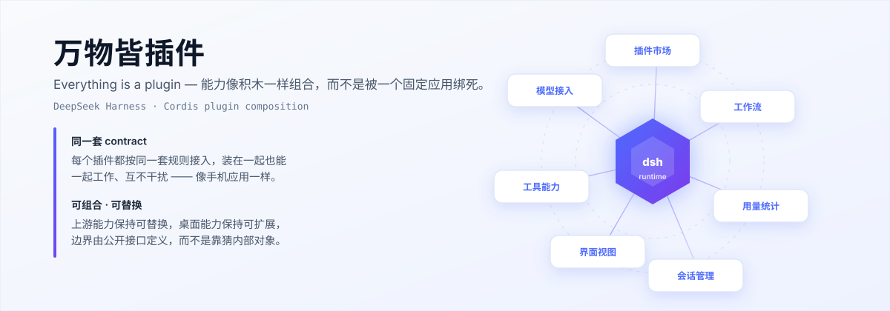

<p align="center">
  
</p>

<p align="center">
  <a href="https://github.com/deepseek-ai/deepseek-harness"></a>
  <a href="#license"></a>
  
  
  
</p>

<p align="center">
  <strong>这里只做一件事：把 GitHub 上的 DSH 插件项目搜集起来，让你搜得到、找得到、复制得走。</strong><br>
  <sub>Collect only. Installing is the official client's job — this repo just helps you find the repo.</sub>
</p>

<p align="center">
  <a href="#what">🧭 这是什么</a> ·
  <a href="#install">🚀 装上这个面板</a> ·
  <a href="#use">🔎 怎么用</a> ·
  <a href="#collect">🔄 数据怎么来</a> ·
  <a href="#compat">🧩 跨版本适配</a> ·
  <a href="#docs">🗺️ 文档</a> ·
  <a href="#contributing">🤝 贡献</a>
</p>

---

<a name="what"></a>

## 🧭 这是什么 · What

**一个 DSH 插件项目搜集器。** 它做三件事：

| | |
|---|---|
| **搜集** | 每 6 小时从 GitHub 上搜一遍 DSH 插件仓库（按 topic 与关键词），再用公开索引补上搜不到的部分 |
| **展示** | 侧栏「插件搜集」面板：项目描述、仓库地址、作者、收藏量，一次取全量、本地即时搜索 |
| **复制** | 一键复制 `github:owner/repo` —— 粘到官方客户端的「添加插件」里就装上了 |

**它不做什么**（这些是刻意的删减，不是还没做）：

| 删掉的 | 为什么 |
|---|---|
| **安装 / 卸载** | 官方桌面版自带「设置 → 插件 → 添加插件」，支持 `github:owner/repo`、npm 包名、本地绝对路径。自己再实现一套安装器，只会多一套会坏、会过期的代码 |
| **检测 / 体检 / 兼容闸门** | 静态检查看不到真实发布产物、看不到运行时行为。它给出的「不安全」结论必然带着猜测，而那个结论会被读成「装不了」 |
| **审核 / 信任分级 / 实测记录** | 那是「维护者要不要为它背书」，而用户真正要回答的只有「这个项目是不是我要找的」 |
| **版本号解析 / 升级提示** | 装了之后要不要更新，是客户端的事；这里只负责让你找到仓库 |

> **一句话**：以前这个仓库是**市场**（告诉你怎么装），现在它是**索引**（告诉你有什么）。
> 装的那一半交给了 harness 官方 —— 那本来就该是它的职责。

---

<a name="install"></a>

## 🚀 装上这个面板 · Install

### 官方桌面版（0.1.7-rc.2 实测）

**设置 → 插件 → 添加插件**，填：

```
github:HaydenSmith1121/dsh-plugins
```

装完重启，左侧导航出现「插件搜集」。

> ★ **为什么是仓库根。** 官方客户端的安装规格解析器只接受
> `host/owner/repo` 形状的地址 —— `https://github.com/a/b/sub` 会被直接拒绝
> （"a URL must point at a git repository or a tarball"）。所以这个仓库的**根目录本身
> 就是插件包**（`package.json` + `cordis.patch.yml` + `src/`），不存在「装子目录」这回事。
> 这也正是 1.0.0 把插件从 `plugins-src/dsh-plugins-market/` 搬到仓库根的原因。

### 命令行 dsh

```bash
dsh plugin --profile web add github:HaydenSmith1121/dsh-plugins
```

<details>
<summary><strong>🔧 装不上时按顺序查这几件事</strong>（点开）</summary>

| 症状 | 先看这里 |
|---|---|
| 提示地址不合法 | 必须是 `github:owner/repo` 或 `https://github.com/owner/repo`，**不能**是仓库里的某个子目录 |
| **「插件安装失败 · 没有写入权限，无法安装」** | ★ **多半不是权限问题**。如果你之前用**本地路径**装过这个插件（`link:`），`node_modules` 里会留下一个 Junction，而 pnpm 是**用 rename 去覆盖**它的 —— Windows 上 rename 覆盖 Junction 必然 EPERM。日志里长这样：<br>`[ERR_PNPM_EPERM] [importPackage ...\node_modules\dsh-plugins-market]`<br>`rename '...dsh-plugins-market_tmp_28040_1' -> '...dsh-plugins-market'`<br>**修法**：先卸载旧的那份；或手工删掉那个链接再重装 ——<br>`cmd /c rmdir "<profile>\node_modules\dsh-plugins-market"`<br>（一定用 `rmdir`：会递归的删除命令有可能顺着链接把**你真正的源码目录**删掉。） |
| 装完重启后侧栏没有「插件搜集」 | 面板是**客户端**半，需要真的重启一次 web/GUI，不是刷新页面 |
| 提示「**需要允许安装脚本**：`@google/genai`、`protobufjs`」 | 这是**你 profile 里既有的**状态，来自另一个插件（`dsh-opencode-go-plus`），不是本插件带来的 —— 本插件没有任何依赖。点「允许这些脚本并重试」即可；也可以在 `pnpm-workspace.yaml` 的 `allowBuilds` 里把它们写成 `false`（这两个包都不需要真的执行构建脚本：`protobufjs` 的 postinstall 只打印一行提示，`@google/genai` 的 prepare 对 tarball 安装本就不执行） |
| 装完报 peer / 版本相关错误 | 本包**不声明任何 peerDependencies**，不该出现这类错误；出现了请开 Issue 并附上 `dsh --version` |
| 面板打开了但列表是空的、也没有报错 | 面板会显示数据来源。若显示「包内离线快照」，说明本机连不上 GitHub；点面板右上「关于」能看到具体原因 |
| 「关于」里显示 `source: remote` | 这是**正常**的：运行时从仓库拉取最新索引。1.0.1 起安装包也包含完整离线目录，首次安装且连不上 GitHub Raw 时不会再只显示 400 条；离线数据的新鲜度取决于安装包版本 |

</details>

> ⚠️ **清理这类链接时，一定要用不带 `/s` 的 `rmdir`，并且在删之前先看一眼它到底是什么。**
>
> 这不是多余的谨慎，是本项目**真的踩过**的坑：`node_modules` 里与包同名、看起来像
> 临时目录的条目，**也可能是指向你源码目录的链接**；对链接执行递归删除
> （`rmdir /s /q`、`Remove-Item -Recurse`）会**穿过链接**去删真正的源码。
> 2026-09-27 就因此丢掉过一次本仓库的 `.git`（工作区文件因为被运行中的 harness
> 占着反而幸存下来，最后靠远端仓库整份恢复 —— 所以「先推再折腾」这件事值钱）。
>
> 删之前先确认：
>
> ```powershell
> Get-Item "<路径>" -Force | Select-Object LinkType, Target
> # LinkType 为空 → 真目录，可以删
> # LinkType=Junction/SymbolicLink → 是链接，只用 cmd /c rmdir "<路径>"（不带 /s）
> ```
>
> 另外：**别把这类命令的错误输出丢掉**（`2>&1 | Out-Null`）。当时正是因为把错误
> 吞了，删失败没能当场看见。

---

<a name="use"></a>

## 🔎 怎么用 · How

| 操作 | 说明 |
|---|---|
| **搜索** | 支持多个词（空格分隔表示「都要命中」）。可搜仓库名、作者、描述、topic、语言 —— 全在本地做，按键即出结果 |
| **`/`** | 聚焦搜索框 |
| **`Esc`** | 清空搜索 |
| **复制安装地址** | 复制 `github:owner/repo`，直接粘进官方客户端的「添加插件」 |
| **链接** | 复制 `https://github.com/owner/repo` |
| **点仓库名** | 在 GitHub 上打开项目 |
| **刷新** | 去仓库确认一次有没有更新。走的是条件请求，没更新时远端只回一个 304，几乎不花流量 |
| **关于** | 面板版本、数据来源与新鲜度、以及**当前 harness 的版本与能力探测结果** |

### 面板为什么快

| 做法 | 效果 |
|---|---|
| 索引**一次取全量**（列式压缩 + gzip） | 打开面板一次传输，之后搜索不再有网络往返 |
| **本地建索引 + 本地检索** | 九千多条记录的检索在 10ms 量级 |
| **虚拟滚动**（只渲染视口里的十几行） | 滚动不掉帧，行数再多也一样 |
| **模块级缓存** | 面板切走再切回来是瞬时的，不重新取数 |
| **服务端条件请求 + 30 分钟 TTL** | 「刷新」通常只是一次 304 |

---

<a name="collect"></a>

## 🔄 数据怎么来 · Collect

采集器是 [`scripts/collect.mjs`](./scripts/collect.mjs)，由 GitHub Actions **每 6 小时**跑一次
（[`.github/workflows/collect.yml`](./.github/workflows/collect.yml)），内容真的变了才提交。

| 来源 | 作用 | 说明 |
|---|---|---|
| **GitHub 搜索** | 主力 | 按 `topic:dsh-plugin`、`topic:deepseek-harness` 等 topic 与关键词检索，**一次拿 100 个完整仓库对象** —— 描述、作者、star 数、语言、topic、许可全在里面 |
| **公开索引** | 兜底 | 第三方维护的 DSH 插件清单，覆盖大量没打 topic、搜不到的仓库 |
| **[`catalog/seed.json`](./catalog/seed.json)** | 人工 | 两者都漏掉的写进 `include`；作者要求下架的写进 `exclude` |

> ★ **为什么是「多个窄查询」而不是「一个宽查询翻到底」。**
> GitHub 搜索接口每个查询最多返回 1000 条，认证后每分钟只有 30 次请求。
> 与其在一个查询里翻 10 页，不如用多个切面各取前几页 —— 覆盖面更广，
> 而且每个切面天然按 star 降序拿到了头部。

**三条硬规矩**（都写进了测试，坏了会红）：

| 规矩 | 为什么 |
|---|---|
| **内容没变就不动时间戳** | 每 6 小时一次的无脑刷新会让几千条记录天天显示为「已修改」，真正的变更被噪音淹没 |
| **没看过就不删** | 某个来源这一轮失败了（限流、断网），由它发现的记录**原样保留**。把「没查到」当成「不存在」是这类采集器最容易犯的错 |
| **输出逐字节确定** | 同输入必得同字节：排序规则固定、键顺序固定、时间戳只在内容真的变了时推进 |

本地怎么跑：

```bash
node scripts/collect.mjs            # 联网采集（CI 跑的就是它）
node scripts/collect.mjs --check    # 只读校验：不联网、不写盘
node scripts/collect.mjs --offline  # 用 .cache/ 里上一轮的原始数据重跑
node scripts/collect.mjs --only owner/repo   # 只处理一个仓库
node scripts/collect.mjs --limit 200         # 试跑，不写盘
```

---

<a name="compat"></a>

## 🧩 跨版本适配 · Compatibility

**目标：同一个包，同时活在 dsh 0.1.5 / 0.1.6 / 0.1.7-rc.2（含官方桌面版）上。**

| 做法 | 为什么 |
|---|---|
| **一个 peerDependency 都不写** | dsh 0.1.7 起会在导入插件前核对 peer 里 `@deepseek-ai/dsh*` 与运行时版本是否一致。写了 peer 就等于把自己钉死在一个版本上 |
| **不声明 `engines.dsh`** | 同上：声明了就会挡住别的版本 |
| **服务器半只用 Node 内置模块** | 没有依赖就没有 `ERR_PNPM_IGNORED_BUILDS`、没有解析失败、没有离线不可用 |
| **只用各版本都在的 API** | 服务器半：`ctx.effect` + `webServer.register({kind,path,handler})`；客户端半：`slots.inject` / `slots.register` + baseline 的 `react` |
| **能力探测代替版本判断** | 真正决定能不能干活的是 `webServer.register` 在不在，不是版本号字符串。缺了会在面板「关于」里显示成 ✗，而不是白屏 |
| **失败降级，绝不罢工** | 路由注册失败、服务拿不到、上下文构建失败 —— 一律记一行日志继续跑，harness 本身不受影响 |

机器可读的矩阵在 [`compatibility.json`](./compatibility.json)：
**它只回答「这个版本有没有人真的跑过」，不构成任何闸门** ——
版本不在表里，插件照样全功能可用。

| dsh 版本 | 通道 | 状态 |
|---|---|---|
| `0.1.7-rc.2` | 官方桌面版 | ✅ 实测通过（从桌面版装、面板打开、搜索与复制可用） |
| `0.1.6-alpha.2` | 命令行 | ✅ 实测通过（宿主半 + 客户端半 + 启动图登记，全部实测） |
| `0.1.5-rc.3` | 命令行 | ✅ 实测通过（该线宿主服务更少，能力探测如实报出，功能不受影响） |
| `0.1.6-alpha.1` | 命令行 | ⛔ **上游发版问题，与本插件无关**（见下） |
| `0.1.5-rc.1` / `0.1.5-rc.2` | 命令行 | ⚠️ 未单独实测（同线 rc.3 已通过） |

> ⚠️ **一个与插件无关的上游陷阱**：`dsh@0.1.6-alpha.1` 的依赖写的是 `^0.1.6-alpha.1`，
> 而 `0.1.6-alpha.2` 已经发布 —— 所以照常安装会解析到 alpha.2 的那批库，
> 而 alpha.1 的 CLI 却 import 了 alpha.2 里已不存在的导出，**装完直接起不来**
> （`does not provide an export named 'watchUserPatches'`）。任何插件都装不上。
> 装**同一线的最新版**最稳。详见 [`docs/版本兼容.md`](./docs/版本兼容.md)。

详见 [`docs/版本兼容.md`](./docs/版本兼容.md)。

---

<a name="docs"></a>

## 🗺️ 文档地图 · Docs

| 想看什么 | 去哪里 |
|---|---|
| 仓库里都有什么、每个目录干什么 | [`docs/目录结构.md`](./docs/目录结构.md) |
| 采集器端到端：来源、合并规则、时间戳策略 | [`docs/采集说明.md`](./docs/采集说明.md) |
| `catalog/index.json` 的字段含义与来源 | [`docs/数据格式.md`](./docs/数据格式.md) |
| 面板的接口、性能做法与错误处理 | [`docs/面板说明.md`](./docs/面板说明.md) |
| 跨版本适配策略、踩过的坑 | [`docs/版本兼容.md`](./docs/版本兼容.md) |
| 怎么贡献、收录规范、PR 检查清单 | [`CONTRIBUTING.md`](./CONTRIBUTING.md) |

---

<a name="contributing"></a>

## 🤝 贡献 · Contributing

**最需要的三类贡献**（都不需要你会写这个插件）：

| 优先级 | 类型 | 怎么做 |
|---|---|---|
| ★★★ | **补上没被采到的仓库** | 开 Issue 或 PR 把 `owner/repo` 写进 [`catalog/seed.json`](./catalog/seed.json) 的 `include` |
| ★★ | **补上新 dsh 版本的实测结论** | 装上、打开面板、把结果写进 [`compatibility.json`](./compatibility.json)（**只写你真的跑过的**） |
| ★ | **改进采集器与面板** | `scripts/`、`src/`、`docs/` 都欢迎；提交前跑 `node test/run.mjs` |

> **别猜。** 拿不到的描述与 star 数一律写 `null`，没实测过的版本一律写 `expected` ——
> 这个仓库的价值就在于「它说的每句话都能追溯到一次真实的采集或一次真实的运行」。

完整规范见 [`CONTRIBUTING.md`](./CONTRIBUTING.md)。

---

<a name="license"></a>

## ⚖️ 许可 · License

- 本仓库**自身的**代码与文档：MIT
- **第三方插件项目的版权归各自原作者所有。** 本仓库只记录公开可见的元数据
  （描述、地址、作者、star 数），**不分发任何插件字节**，安装时去上游取
- 如你是某个项目的作者，希望本仓库移除或调整收录方式，请开 Issue 或直接联系，我们会立即处理

---

<p align="center">
  <sub>万物皆插件 · Everything is a plugin —— 这个仓库只负责让你找到它们。</sub>
</p>
